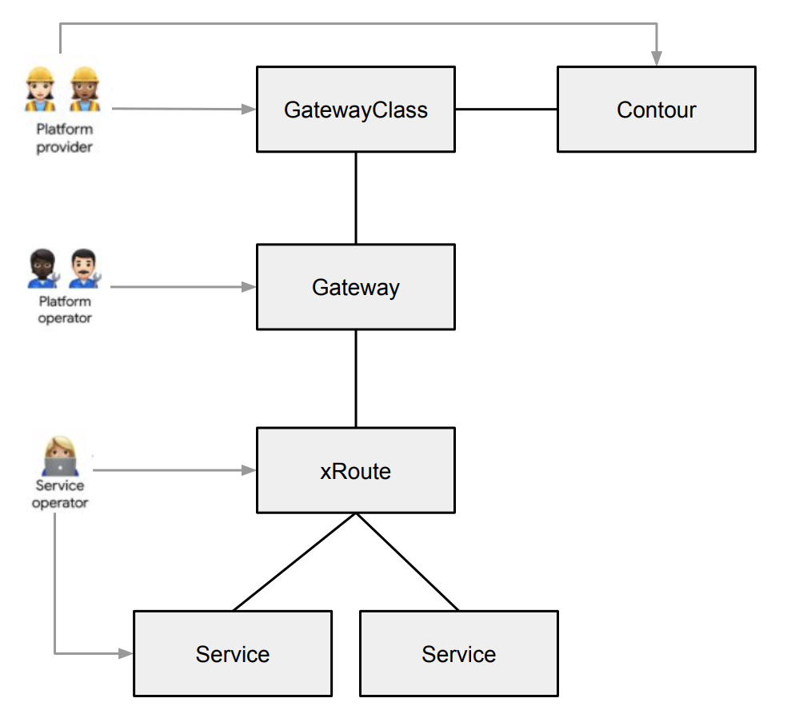
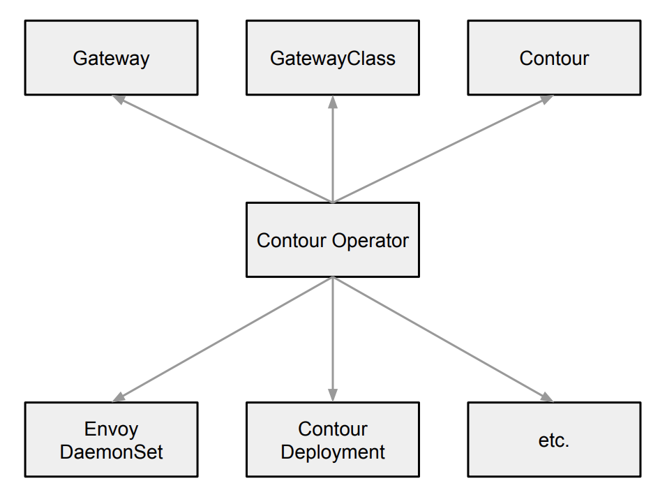

# Service APIs

This document outlines a design for implementing [Service APIs][1] in Contour Operator.

## Goals

- Manage Contour and dependent resources using Service APIs.

## Non Goals

- Support application-level Service APIs, i.e. xRoute. These APIs will be supported by Contour directly according to
  Issue [2809][2].

## Definitions

- A Contour instance or an instance of Contour defines a fully functional Contour deployment that runs on a Kubernetes
  cluster, i.e. `kubectl apply -f https://projectcontour.io/quickstart/contour.yaml`.

### Service APIs

Service APIs is an open source project managed by the Kubernetes SIG-NETWORK community. The project's goal is to evolve
service networking APIs within the Kubernetes ecosystem. Service APIs provide interfaces to expose Kubernetes
applications- Services, Ingress, and more.

## Background

Contour Operator manages Contour using the `contours.operator.projectcontour.io` Custom Resource Definition (CRD). The
Contour custom resource provides the user interface for managing an instance of Contour and is handled by the Kubernetes
API just like built-in objects. Contour Operator monitors the Contour custom resource and provides status on whether the
actual state matches the desired state of the object. Contour Operator will continue supporting the CRD to manage
Contour. Adding support for Service APIs will provide users an alternative approach to managing Contour.

## High-Level Design

Contour Operator will manage Contour using the GatewayClass, Gateway, and Contour custom resources. Service API xRoute
resources, i.e. HTTPRoute, will be managed by Contour and NOT Contour Operator. Service APIs target different user
personas that are responsible for defining and exposing an application in a Kubernetes cluster:

- __Platform Provider__: The Platform Provider is responsible for the overall environment that the cluster runs in, i.e.
  the cloud provider. The Platform Provider will interact with GatewayClass and Contour resources.
- __Platform Operator__: The Platform Operator is responsible for overall cluster administration. They manage policies,
  network access, application permissions and will interact with the Gateway resource.
- __Service Operator__: The Service Operator is responsible for defining application configuration and service
  composition. They will interact with xRoute resources and other typical Kubernetes resources.

The following diagram illustrates the relationship between personas and resources:

<p align="center">

</p>

__Note:__ The personas are meant to provide a framework to users; each environment may alter the persona-to-resource
relationship based on individual requirements.

Service APIs provide extension-points to allow linking of resources at various layers. This provides more granular
customization at the appropriate places within the API structure. These extension-points will be used to expose
Contour-specific configuration.

## Detailed Design

Contour Operator will watch GatewayClass, Gateway, and Contour resources and instantiate an instance of Contour:

<p align="center">

</p>

The operator will perform the following behavior in response to these resources:
1. Validate `spec` of a Contour and surface the applicable status condition, i.e. "Available".
2. Check `gatewayclass.spec.controller` to determine if it's responsible for managing the GatewayClass.
3. Check `gatewayclass.spec.parametersRef` to determine the Contour resource used for configuring a Gateway of this
GatewayClass. If the Contour exists and is valid for this GatewayClass, set the "Admitted" GatewayClass status
condition. If the Contour does not exist or is invalid for this GatewayClass, set the "InvalidParameters" GatewayClass
status condition. Finalize the Contour with `gatewayclass-exists-finalizer.operator.projectcontour.io`.
4. Process a Gateway if `gateway.spec.gatewayClassName` matches a GatewayClass that is being managed by the operator,
and if the GatewayClass is "Admitted". The presence of a Gateway will trigger the operator to instantiate a Contour
instance using the configuration from Contour and Gateway resources. __Note:__ Contour will read Gateway fields to
construct its DAG, configure Envoy listeners, etc.
5. Finalize the GatewayClass when the operator provisions the Contour instance.

The following sections provide additional details of the proposed implementation plan.

### GatewayClass

GatewayClass is a cluster-scoped resource that defines a set of Gateways sharing a common behavior. A GatewayClass
with `controller: projectcontour.io/contour-operator` will be managed by Contour Operator. There MUST be at least one
GatewayClass defined in order to have a functional Gateway. This is similar to IngressClass for Ingress and StorageClass
for PersistentVolumes.

The following is an example of a GatewayClass managed by Contour Operator:

```yaml
kind: GatewayClass
apiVersion: networking.x-k8s.io/v1alpha1
metadata:
  name: example-gatewayclass
spec:
  controller: projectcontour.io/contour-operator
  parametersRef:
    name: example-contour
    group: operator.projectcontour.io
    kind: Contour
```

The `controller` field is a domain/path string that indicates the controller responsible for managing Gateways of this
class. The `projectcontour.io/contour-operator` string will be used to specify Contour Operator as the responsible
controller. This field is not mutable and cannot be empty.

The `parametersRef` field is a reference to an implementation-specific resource containing configuration parameters
associated to the GatewayClass. This field will be used to expose Contour-specific configuration. If the field is
unspecified, the operator will create an instance of Contour with default settings. Since `parametersRef` does not
contain a namespace field, the referenced resource must exist in a known namespace. The operator's namespace will be
used as the known namespace. If the referenced resource cannot be found, the operator will set the GatewayClass
`InvalidParameters` status condition to true.

### Contour

The Contour custom resource will be used to provide a structured object for representing the configuration of a Contour
instance. A Contour custom resource will be consumed by a GatewayClass. Since the Contour custom resource currently
triggers the operator to instantiate a Contour instance, a field will be added to prevent this behavior and treat the
Contour as a configuration-only resource. The following data structure will be used to manage this behavior:

```go
// ContourSpec currently exists.
type ContourSpec struct {
	// GatewayClassRef is a reference to a GatewayClass used for managing
	// a Contour.
	//
	// +kubebuilder:default=None
    GatewayClassRef string `json:"gatewayClassRef,omitempty"`
}
```

The `gatewayClassRef` field is a reference to a GatewayClass used for managing the Contour. If unspecified, the field
will default to "None", indicating a GatewayClass does not exist, and the operator should use the Contour resource to
instantiate a Contour instance.

The following is an example of a Contour resource that references a GatewayClass:
```yaml
apiVersion: operator.projectcontour.io/v1alpha1
kind: Contour
metadata:
  name: example-contour
  namespace: contour-operator
spec:
  gatewayClassRef: example-gatewayclass
  replicas: 2
  namespace:
    name: projectcontour
```

### Gateway

A Gateway describes how traffic can be translated to Services within a Kubernetes cluster. That is, it defines how to
translate traffic from somewhere that does not know about Kubernetes to somewhere that does. For example, traffic sent
from a client outside the cluster to a Service resource through a proxy such as Contour. While many use-cases have
client traffic originating “outside” the cluster, this is not a requirement.

A Gateway is 1:1 with the lifecycle of the infrastructure configuration. When a Gateway is created, the operator will
create an instance of Contour. Gateway is the resource that triggers actions in Service APIs. Other Service API
resources represent structured configuration that are linked together by a Gateway.

A Gateway MAY contain one or more Service APIs *Route references which serve to forward traffic to a specific service
based on application-level rules. Note that Contour Operator is NOT responsible for managing *Route Service API
resources.

The following is a Gateway example that listens for HTTP traffic on TCP port 80:

```yaml
kind: Gateway
apiVersion: networking.x-k8s.io/v1alpha1
metadata:
  name: example-gateway
  namespace: projectcontour
spec:
  gatewayClassName: example-gatewayclass
  listeners:
    - protocol: HTTP
      port: 80
  ...
```

The `port` or `protocol` fields are required and specify the network port/protocol pair that Envoy will listen on for
connection requests. The operator will use the value of `port` for the Envoy Service resource. If multiple listeners are
specified with unique ports, the operator will represent each port in the Envoy Service. The above Gateway example will
create the following Envoy Service:

```yaml
kind: Service
apiVersion: v1
metadata:
  name: envoy
  namespace: projectcontour
  ...
spec:
  ports:
  - port: 80
    name: http
    protocol: TCP
   ...
```

__Note:__ Contour is responsible for constructing routing rules and forwarding traffic based on other `listeners`
fields.

TLS configuration must be included in the Gateway listener when "HTTPS" or "TLS" is specified for
`protocol`. The `certificateRef` field is a reference to a Secret of type `kubernetes.io/tls` in the Gateway's namespace
containing a TLS certificate and private key. Per the TLS Secret [specification][3], the secret MUST contain the
following keys and data:

- tls.crt: certificate file contents
- tls.key: key file contents
  
For example:

```yaml
kind: Gateway
metadata:
  name: example-gateway
  namespace: projectcontour
...
listeners:
- protocol: HTTPS
  port: 443
  tls:
    mode: Terminate
    certificateRef:
      kind: Secret
      group: core
      name: example-cert
---
kind: Secret
apiVersion: v1
metadata:
  name: example-cert
  namespace: example
data:
  tls.crt: <CERT>
  tls.key: <KEY>
```

Gateway contains a `routes` field that specifies a schema for associating routes with the `listener` using Kubernetes
selectors. A Route is a Service APIs resource capable of servicing a request and allows a user to expose a resource
(i.e. Service) by an externally-reachable URL, proxy traffic to the resource, and terminate SSL/TLS connections.

The following example binds the Gateway to HTTPRoutes with label "app: example":

```yaml
kind: Gateway
apiVersion: networking.x-k8s.io/v1alpha1
metadata:
  name: example-gateway
  namespace: projectcontour
spec:
  gatewayClassName: example-gatewayclass
  listeners:
    - protocol: HTTP
      port: 80
      routes:
        kind: HTTPRoute
        selector:
          matchLabels:
            app: example
---
kind: HTTPRoute
apiVersion: networking.x-k8s.io/v1alpha1
metadata:
  name: example-httproute
  labels:
    app: example
spec:
  gateways:
    allow: All
  rules:
  - forwardTo:
    - serviceName: example-svc
      port: 8080
```

After the operator instantiates a Contour instance, Contour will watch for xRoute resources such as the example
HTTPRoute above and bind the route based on `gateways` field rules.

__Note:__ Contour is responsible for forwarding traffic based on routing rules defined in xRoute resources.

The Gateway `addresses` field specifies one or more network addresses requested for this Gateway. The operator will use
values from this field for the Envoy Service resource. The specific Service field used for the values will depend on the
network publishing type specified in the associated Contour. For example, if the network publishing type is "Internal",
the operator will create an Envoy Service of type "ClusterIP" and set `clusterIPs: 1.2.3.4`.

If `addresses` is unspecified, an IP address will be automatically assigned through existing Kubernetes mechanisms. If
the specified address is invalid or unavailable, the operator will indicate this in Gateway status.

The following is a Gateway example that specifies IP address "1.2.3.4". This address will be used for each Gateway
listener:

```yaml
kind: Gateway
apiVersion: networking.x-k8s.io/v1alpha1
metadata:
  name: example-gateway
  namespace: projectcontour
spec:
  gatewayClassName: example-gatewayclass
  addresses:
    - type: IPAddress
      value: 1.2.3.4
```

Although Gateway supports multiple address types, only "IPAddress" will be supported by the Contour Operator. If a named
address is requested, the operator will surface the "Detached" listener status condition on the Gateway with the
"UnsupportedAddress" reason.

## Upgrades

A GatewayClass of `controller: projectcontour.io/contour-operator` is equivalent to running the latest operator and
Contour release. In this case, a Gateway of this class will be automatically upgraded when the operator is upgraded.
Initially, `projectcontour.io/contour-operator` will be the only supported value. When support is added,
`projectcontour.io/contour-operator/<version>` will be used to version GatewayClasses. Versioning a GatewayClass will
consist of the following workflow:

- The Platform Provider upgrades the operator image from x to y, triggering an upgrade of the operator. The
  Contour CRD is updated if y includes API changes.
- The status of `projectcontour.io/contour-operator/x` GatewayClasses are updated to "Waiting" and associated
  Gateways are updated to "NoSuchGatewayClass". The details for accomplishing this step is TBD (see the Open Questions
  section).
- The operator will no longer manage Gateways of `projectcontour.io/contour-operator/x` GatewayClasses. These
  Gateways will continue to function and traffic will continue to be proxied. Contour/Envoy will continue running x.
- Optionally, the Platform Provider updates the Contour resource referenced by the GatewayClass, or creates and
  associates a new Contour to the GatewayClass. For example, a new configuration field is exposed through the Contour
  resource in y.
- The Platform Provider updates Gateways by setting GatewayClasses to `projectcontour.io/contour-operator/y`. This
  triggers the operator to upgrade Contour/Envoy to y and optionally update the configuration.
  GatewayClass|Gateway|xRoute status conditions are updated accordingly.

## Implementation Details

### Operator

Update the operator to only instantiate a Contour instance if `contour.spec.gatewayClassRef` is "None".

Create a controller that reconciles the GatewayClass resource and performs the following:

- Only reconcile a GatewayClass that specifies `controller: projectcontour.io/contour-operator`.
- Ensure the Contour referenced by a GatewayClass `parametersRef` exists and is valid.
- Update the GatewayClass status conditions accordingly.

Create a controller that reconciles the Gateway resource and performs the following:

- Ensure the GatewayClass specified by `gatewayClassName` exists and add the
  `gateway-exists-finalizer.networking.x-k8s.io` finalizer to a GatewayClass whenever an associated Gateway is running.
- Validate the `spec` configuration.
- Ensure an instance of Contour exists with the desired configuration.  
- Update the Gateway status conditions accordingly.

### RBAC

Existing Contour Operator RBAC policies must be modified to allow the `update` verb for GatewayClass and Gateway
resources.

### Test Plan

- Add e2e, integration, and unit tests.
- Create a CI job to run tests.

### Open Questions

- ~~For versioned GatewayClass support, i.e. `controller: projectcontour.io/contour-operator/v1.12.0`, should Contour be
  responsible for updating GatewayClass|Gateway|xRoute status when it's in this "detached" state? Contour could watch
  the operator's deployment and when unavailable update the status conditions of GatewayClass|Gateway|xRoute resources
  accordingly.~~ Using `gatewayclass.spec.controller as a means to represent an operator/contour version has been
  removed from this design.
- Should `gatewayclass.spec.controller` reference a specific operator by name, i.e.
  `controller: projectcontour.io/contour-operator-example? This would allow platform providers to support multiple
  Contour Operator's.
- If `gatewayclass.spec.parametersRef` is unspecified, should the operator create a Contour instance with default
  settings or should the GatewayClass be considered invalid?
- `Contour` is a namespace-scoped resource. However, `gatewayclass.spec.parametersref` expects a reference to a
  cluster-scoped resource. Should `Contour` be updated to a cluster-scoped resource or should a separate cluster-scoped
  custom resource be created that is similar to `Contour`?

[1]: https://github.com/kubernetes-sigs/service-apis
[2]: https://github.com/projectcontour/contour/issues/2809
[3]: https://kubernetes.io/docs/concepts/configuration/secret/#tls-secrets
